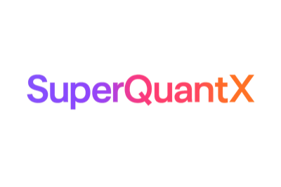

# SuperQuantX

[](https://pypi.org/project/superquantx/)
[](https://pypi.org/project/superquantx/)
[](https://github.com/SuperagenticAI/superquantx/blob/main/LICENSE)
[](https://github.com/SuperagenticAI/superquantx/actions)
[](https://superagenticai.github.io/superquantx)
[](https://github.com/psf/black)
[](https://github.com/astral-sh/ruff)



**Unified Quantum Computing Platform - Building autonomous quantum-enhanced AI systems**

> 📖 **[Read the Full Documentation →](https://superagenticai.github.io/superquantx/)**

**Research by [Superagentic AI](https://super-agentic.ai) - Quantum AI Research**

## 🚀 What is SuperQuantX?

SuperQuantX is a **unified quantum computing platform** that makes quantum algorithms and quantum machine learning accessible through a single, consistent API. Whether you're a researcher, developer, or quantum enthusiast, SuperQuantX provides:

- **🎯 Single API** - Works across all major quantum backends (IBM, Google, AWS, Quantinuum, D-Wave)
- **🤖 Quantum Agents** - Pre-built autonomous agents for trading, research, and optimization
- **🧠 Quantum ML** - Advanced quantum machine learning algorithms and neural networks
- **⚡ Easy Setup** - Get started in minutes with comprehensive documentation

## ✨ Key Features

### **🔗 Universal Quantum Backend Support**
```python
# Same code works on ANY quantum platform
qsvm = sqx.QuantumSVM(backend='pennylane')  # PennyLane
qsvm = sqx.QuantumSVM(backend='qiskit')     # IBM Qiskit
qsvm = sqx.QuantumSVM(backend='cirq')       # Google Cirq
qsvm = sqx.QuantumSVM(backend='braket')     # AWS Braket
qsvm = sqx.QuantumSVM(backend='quantinuum') # Quantinuum H-Series
```

### **🤖 Autonomous Quantum Agents**
Ready-to-deploy intelligent agents powered by quantum algorithms:
- **QuantumTradingAgent** - Portfolio optimization and risk analysis
- **QuantumResearchAgent** - Scientific hypothesis generation and testing
- **QuantumOptimizationAgent** - Complex combinatorial and continuous optimization
- **QuantumClassificationAgent** - Advanced ML with quantum advantage

### **🧠 Quantum Machine Learning**
State-of-the-art quantum ML algorithms:
- **Quantum Support Vector Machines** - Enhanced pattern recognition
- **Quantum Neural Networks** - Hybrid quantum-classical architectures
- **QAOA & VQE** - Optimization and molecular simulation
- **Quantum Clustering** - Advanced data analysis techniques

## 🚀 Quick Start

### Installation
```bash
# Install with uv (recommended)
curl -LsSf https://astral.sh/uv/install.sh | sh
git clone https://github.com/SuperagenticAI/superquantx.git
cd superquantx
uv sync --extra all

# Or with pip
pip install superquantx
```

### Deploy Your First Quantum Agent
```python
import superquantx as sqx

# Deploy quantum trading agent
agent = sqx.QuantumTradingAgent(
    strategy="quantum_portfolio",
    risk_tolerance=0.3
)
results = agent.deploy()
print(f"Performance: {results.metrics}")
```

### Quantum Machine Learning
```python
# Quantum SVM with automatic backend selection
qsvm = sqx.QuantumSVM(backend='auto')
qsvm.fit(X_train, y_train)
accuracy = qsvm.score(X_test, y_test)

# Compare quantum vs classical performance
automl = sqx.QuantumAutoML()
best_model = automl.fit(X_train, y_train)
report = automl.quantum_advantage_report()
```

### Advanced Quantum Algorithms
```python
# Molecular simulation with VQE
vqe = sqx.VQE(molecule="H2", backend="pennylane")
ground_state = vqe.optimize()

# Optimization with QAOA
qaoa = sqx.QAOA(problem=optimization_problem)
solution = qaoa.solve()
```

## 📖 Documentation

**Complete documentation is available at [superagenticai.github.io/superquantx](https://superagenticai.github.io/superquantx/)**

The documentation includes comprehensive guides for getting started, detailed API references, tutorials, and examples for all supported quantum backends. Visit the documentation site for:

- **Getting Started** - Installation, configuration, and your first quantum program
- **User Guides** - Platform overview, backends, and algorithms
- **Tutorials** - Hands-on quantum computing and machine learning examples
- **API Reference** - Complete API documentation with examples
- **Development** - Contributing guidelines, architecture, and testing

## 🎯 Supported Platforms

SuperQuantX provides unified access to **all major quantum computing platforms**:

| Backend | Provider | Hardware | Simulator |
|---------|----------|----------|-----------|
| **PennyLane** | Multi-vendor | ✅ Various | ✅ |
| **Qiskit** | IBM | ✅ IBM Quantum | ✅ |
| **Cirq** | Google | ✅ Google Quantum AI | ✅ |
| **AWS Braket** | Amazon | ✅ IonQ, Rigetti | ✅ |
| **TKET** | Quantinuum | ✅ H-Series | ✅ |
| **Ocean** | D-Wave | ✅ Advantage | ✅ |

## 🤖 Quantum Agents

Pre-built autonomous agents for complex problem solving:

- **🏦 QuantumTradingAgent** - Portfolio optimization and risk analysis
- **🔬 QuantumResearchAgent** - Scientific hypothesis generation and testing
- **⚡ QuantumOptimizationAgent** - Combinatorial and continuous optimization
- **🧠 QuantumClassificationAgent** - Advanced ML with quantum advantage

## 🧮 Quantum Algorithms

Comprehensive library of quantum algorithms and techniques:

### **🔍 Quantum Machine Learning**
- **Quantum Support Vector Machines (QSVM)** - Enhanced pattern recognition with quantum kernels
- **Quantum Neural Networks (QNN)** - Hybrid quantum-classical neural architectures
- **Quantum Principal Component Analysis (QPCA)** - Quantum dimensionality reduction
- **Quantum K-Means** - Clustering with quantum distance calculations

### **⚡ Optimization Algorithms**
- **Quantum Approximate Optimization Algorithm (QAOA)** - Combinatorial optimization
- **Variational Quantum Eigensolver (VQE)** - Molecular simulation and optimization
- **Quantum Annealing** - Large-scale optimization with D-Wave systems

### **🧠 Advanced Quantum AI**
- **Quantum Reinforcement Learning** - RL with quantum advantage
- **Quantum Natural Language Processing** - Quantum-enhanced text analysis
- **Quantum Computer Vision** - Image processing with quantum circuits

## 💡 Why SuperQuantX?

| Traditional Approach | SuperQuantX Advantage |
|--------------------|---------------------|
| ❌ Multiple complex SDKs | ✅ Single unified API |
| ❌ Months to learn quantum | ✅ Minutes to first algorithm |
| ❌ Backend-specific code | ✅ Write once, run anywhere |
| ❌ Manual optimization | ✅ Automatic backend selection |
| ❌ Limited algorithms | ✅ Comprehensive algorithm library |

## 🤝 Contributing

We welcome contributions to SuperQuantX! Here's how to get involved:

### **🔧 Development Setup**
```bash
# Fork and clone the repository
git clone https://github.com/your-username/superquantx.git
cd superquantx

# Install development dependencies
uv sync --extra dev

# Run tests to verify setup
uv run pytest
```

### **🐛 Bug Reports & Feature Requests**
- **[Open an issue](https://github.com/SuperagenticAI/superquantx/issues)** - Report bugs or request features
- **[Read contributing guide](docs/development/contributing.md)** - Detailed contribution guidelines

### **📝 Documentation**
Help improve our documentation:
- Fix typos and clarify explanations
- Add examples and tutorials
- Improve API documentation
- Translate documentation

## 🔗 Resources & Community

### **📚 Learn More**
- **[Official Documentation](docs/)** - Complete guides and API reference
- **[Tutorial Notebooks](examples/)** - Jupyter notebooks with examples


## 📄 License

SuperQuantX is released under the [Apache License 2.0](LICENSE). Feel free to use it in your projects, research, and commercial applications.

---

## 🚀 Get Started Now

```bash
# Install SuperQuantX
pip install superquantx

# Deploy your first quantum agent
python -c "
import superquantx as sqx
agent = sqx.QuantumOptimizationAgent()
print('✅ SuperQuantX is ready!')
"
```

**Ready to explore quantum computing?**

👉 **[Start with the Quick Start Guide →](https://superagenticai.github.io/superquantx/)**

---

<div align="center">

**SuperQuantX: Making Quantum Computing Accessible to all**

*Built with ❤️ by [Superagentic AI](https://super-agentic.ai)*

⭐ **Star this repo** if SuperQuantX helps your quantum journey!

</div>
