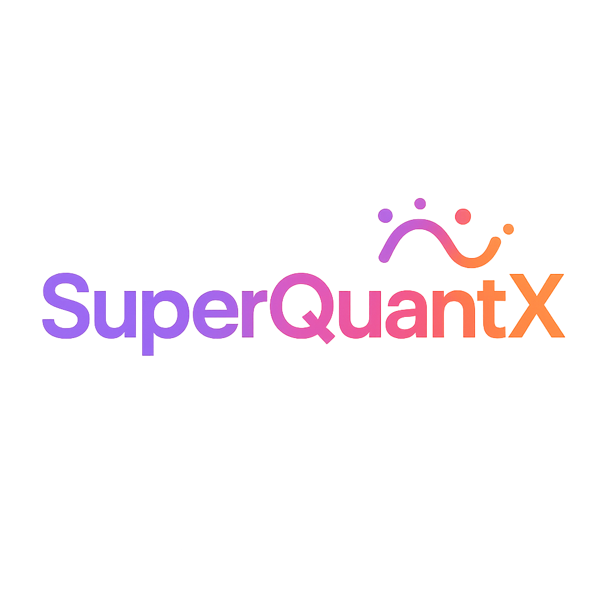

# SuperQuantX Documentation

<div align="center">
  
</div>

<div class="hero-banner">
  <h2 class="superquant-gradient">Unified Quantum Computing Platform</h2>
  <p><strong>Building autonomous quantum-enhanced AI systems</strong></p>
  <p>A cutting-edge quantum computing research platform that provides a unified API for quantum agentic AI systems.</p>
</div>

## Welcome to SuperQuantX

SuperQuantX bridges the gap between quantum computing and artificial intelligence, enabling researchers and developers to build sophisticated quantum-enhanced AI agents with a single, unified API.

### 🚀 Key Features

- **🔗 Unified API**: Single interface for multiple quantum computing backends
- **🎯 Agentic AI Focus**: Specialized tools for quantum agent development
- **🚀 Multi-Backend Support**: PennyLane, Qiskit, Cirq, Amazon Braket, TKET, D-Wave Ocean
- **📊 Advanced Algorithms**: Pre-built quantum machine learning and optimization algorithms
- **🛠️ Developer Friendly**: Comprehensive documentation and examples
- **⚡ High Performance**: Optimized for research and production workloads

### 🎯 Supported Backends

| Backend | Provider | Features |
|---------|----------|----------|
| **PennyLane** | Multi-vendor | Differentiable programming, ML integration |
| **Qiskit** | IBM | IBM hardware, advanced transpilation |
| **Cirq** | Google | Google hardware, NISQ algorithms |
| **Amazon Braket** | AWS | AWS cloud quantum computing |
| **TKET** | Cambridge Quantum Computing | Advanced optimization |
| **D-Wave Ocean** | D-Wave | Quantum annealing |

## Quick Start

Get started with SuperQuantX in minutes:

```python
import superquantx as sqx

# Create a quantum circuit
circuit = sqx.Circuit(n_qubits=2)
circuit.h(0)  # Hadamard gate
circuit.cnot(0, 1)  # CNOT gate

# Choose your backend
backend = sqx.get_backend('pennylane')

# Execute the circuit
result = backend.execute(circuit, shots=1024)
```

## Navigation

<div class="grid" markdown>

<div markdown>
### 📚 Getting Started
Learn the basics and get up and running quickly.

- [Installation Guide](getting-started/installation.md)
- [Quick Start](getting-started/quickstart.md)
- [First Program](getting-started/first-program.md)
- [Configuration](getting-started/configuration.md)
</div>

<div markdown>
### 👨‍💻 User Guide
Comprehensive guides for using SuperQuantX.

- [Platform Overview](user-guide/overview.md)
- [Quantum Backends](user-guide/backends.md)
- [Algorithm Guide](user-guide/algorithms.md)
</div>

<div markdown>
### 🧪 Tutorials
Hands-on tutorials and examples.

- [Basic Quantum Computing](tutorials/basic-quantum.md)
- [Quantum Machine Learning](tutorials/quantum-ml.md)
</div>

<div markdown>
### 📖 API Reference
Complete API documentation.

- [Core API](api/core.md)
- [Backends](api/backends.md)
- [Algorithms](api/algorithms.md)
- [Circuits](api/circuits.md)
- [Agents](api/agents.md)
</div>

</div>

## Research Areas

SuperQuantX accelerates research in:

- **Quantum Machine Learning**: QSVM, QNN, quantum feature maps
- **Quantum Optimization**: QAOA, VQE, quantum annealing
- **Quantum Agents**: Decision-making quantum systems
- **Hybrid Algorithms**: Classical-quantum hybrid approaches
- **NISQ Applications**: Near-term quantum device algorithms

## Community & Support

- 📧 **Email**: research@super-agentic.ai
- 🐛 **Issues**: [GitHub Issues](https://github.com/SuperagenticAI/superquantx/issues)
- 💬 **Discussions**: [GitHub Discussions](https://github.com/SuperagenticAI/superquantx/discussions)
- 📖 **Source Code**: [GitHub Repository](https://github.com/SuperagenticAI/superquantx)

---

<div align="center">
  <p><strong>Built with ❤️ for the Quantum AI research community</strong></p>
  <p><em>Developed by <a href="https://super-agentic.ai">Superagentic AI</a></em></p>
</div>
